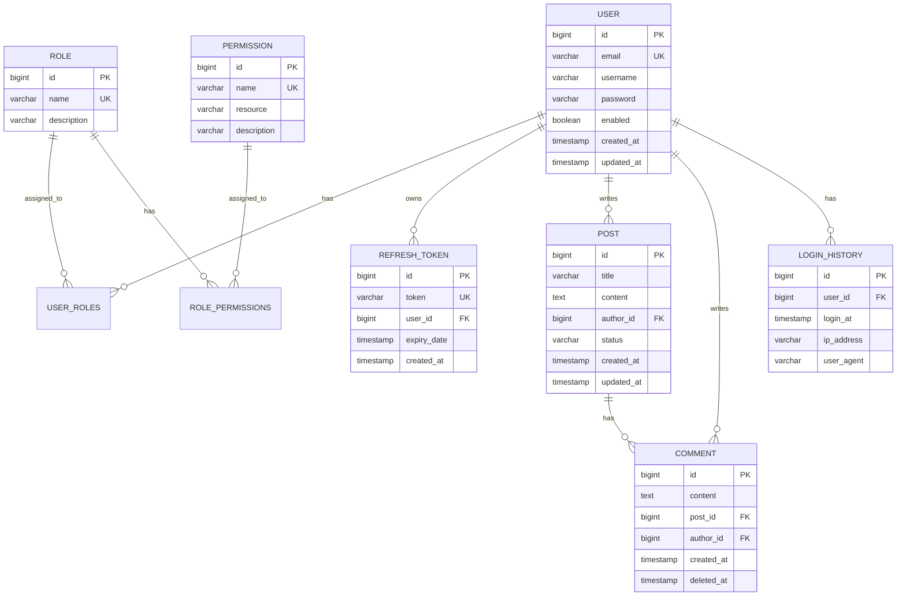

# EnjoyClaude 어드민 시스템 설계 문서

## 📋 목차
1. [프로젝트 개요](#1-프로젝트-개요)
2. [아키텍처 설계](#2-아키텍처-설계)
3. [패키지 구조](#3-패키지-구조)
4. [레이어별 역할](#4-레이어별-역할)
5. [DTO 및 Assembler 패턴](#5-dto-및-assembler-패턴)
6. [도메인 모델](#6-도메인-모델)
7. [API 설계](#7-api-설계)
8. [코드 예시](#8-코드-예시)
9. [데이터 흐름](#9-데이터-흐름)
10. [설정 및 의존성](#10-설정-및-의존성)
11. [공통 예외 처리](#11-공통-예외-처리)
12. [감사 로그 및 AOP](#12-감사-로그-및-aop)

---

## 1. 프로젝트 개요

### 1.1 프로젝트 정보
- **프로젝트명**: EnjoyClaude Admin
- **목적**: 사용자, 권한, 콘텐츠를 관리하는 어드민 대시보드
- **아키텍처**: Layered Architecture (계층형 아키텍처)
- **데이터베이스**: H2 In-Memory Database

### 1.2 기술 스택
| 항목 | 기술 |
|------|------|
| Java | 17 |
| Framework | Spring Boot 2.7.5 |
| Build Tool | Gradle |
| Database | H2 (In-Memory) |
| ORM | JPA (Hibernate) |
| Security | Spring Security + JWT |
| Password Encryption | BCrypt |

### 1.3 주요 기능
- 🔐 **인증/인가**: JWT 기반 인증, RBAC 권한 관리
- 👥 **사용자 관리**: CRUD, 역할 할당, 계정 활성화/비활성화
- 🔑 **역할/권한 관리**: Role/Permission CRUD, 역할-권한 매핑
- 📊 **대시보드**: 사용자 통계, 로그인 이력, 시스템 모니터링
- 📝 **게시물 관리**: 게시글/댓글 관리, 상태 변경

---

## 2. 아키텍처 설계

### 2.1 Layered Architecture

```
┌─────────────────────────────────────────────────────────────┐
│                    Interface Layer                           │
│  - Controller (HTTP 요청/응답 처리)                         │
│  - DTO (ViewRequest/ViewResponse)                           │
└────────────────────┬────────────────────────────────────────┘
                     │
┌────────────────────┴────────────────────────────────────────┐
│                  Application Layer                           │
│  - ApplicationService (유스케이스 조율)                    │
│  - Assembler (Domain ↔ ViewDTO 변환)                       │
└────────────────────┬────────────────────────────────────────┘
                     │
┌────────────────────┴────────────────────────────────────────┐
│                    Domain Layer                              │
│  - Domain Object (순수 비즈니스 로직)                       │
│  - Domain Service (도메인 로직)                             │
│  - Repository Interface (의존성 역전)                       │
└────────────────────┬────────────────────────────────────────┘
                     │
┌────────────────────┴────────────────────────────────────────┐
│                Infrastructure Layer                          │
│  - Entity (JPA Entity)                                       │
│  - PersistenceAssembler (Domain ↔ Entity 변환)             │
│  - Repository Implementation                                 │
│  - External API Client & Assembler                          │
│  - Security & JWT                                            │
└─────────────────────────────────────────────────────────────┘
```

### 2.2 의존성 방향
```
Interface → Application → Domain ← Infrastructure
```
- **의존성 역전 원칙(DIP)**: Domain Layer가 Infrastructure에 의존하지 않음
- Infrastructure가 Domain의 Repository 인터페이스를 구현

---

## 3. 패키지 구조

```
src/main/java/com/enjoy/EnjoyClaude/
├── config/                                     # 설정
│   ├── SecurityConfig.java
│   └── JpaConfig.java
│
├── domains/                                    # 도메인 레이어
│   ├── user/
│   │   ├── User.java                          # 도메인 객체 (순수 Java)
│   │   ├── UserRepository.java                # 인터페이스만 정의
│   │   └── UserService.java                   # 도메인 서비스
│   ├── role/
│   │   ├── Role.java
│   │   ├── Permission.java
│   │   ├── RoleRepository.java
│   │   └── RoleService.java
│   ├── auth/
│   │   ├── RefreshToken.java
│   │   └── RefreshTokenRepository.java
│   ├── post/
│   │   ├── Post.java
│   │   ├── Comment.java
│   │   ├── PostRepository.java
│   │   └── PostService.java
│   └── common/
│       ├── vo/                                 # Value Objects
│       │   ├── Email.java
│       │   └── PostStatus.java
│       └── exception/
│           ├── UserNotFoundException.java
│           └── DuplicateEmailException.java
│
├── applications/                               # 애플리케이션 레이어
│   ├── auth/
│   │   ├── AuthApplicationService.java
│   │   ├── AuthAssembler.java                 # Domain ↔ ViewDTO
│   │   └── JwtService.java
│   ├── user/
│   │   ├── UserApplicationService.java
│   │   └── UserAssembler.java
│   ├── role/
│   │   ├── RoleApplicationService.java
│   │   └── RoleAssembler.java
│   ├── post/
│   │   ├── PostApplicationService.java
│   │   └── PostAssembler.java
│   └── dashboard/
│       ├── DashboardApplicationService.java
│       └── DashboardAssembler.java
│
├── infrastructures/                            # 인프라 레이어
│   ├── persistence/                            # 영속성 (DB)
│   │   ├── entity/
│   │   │   ├── UserEntity.java
│   │   │   ├── RoleEntity.java
│   │   │   ├── PermissionEntity.java
│   │   │   ├── RefreshTokenEntity.java
│   │   │   ├── PostEntity.java
│   │   │   ├── CommentEntity.java
│   │   │   └── LoginHistoryEntity.java
│   │   ├── jpa/
│   │   │   ├── UserJpaRepository.java
│   │   │   ├── RoleJpaRepository.java
│   │   │   ├── PermissionJpaRepository.java
│   │   │   ├── RefreshTokenJpaRepository.java
│   │   │   ├── PostJpaRepository.java
│   │   │   └── CommentJpaRepository.java
│   │   ├── assembler/                          # Domain ↔ Entity
│   │   │   ├── UserPersistenceAssembler.java
│   │   │   ├── RolePersistenceAssembler.java
│   │   │   ├── PermissionPersistenceAssembler.java
│   │   │   ├── RefreshTokenPersistenceAssembler.java
│   │   │   ├── PostPersistenceAssembler.java
│   │   │   └── CommentPersistenceAssembler.java
│   │   └── repository/
│   │       ├── UserRepositoryImpl.java
│   │       ├── RoleRepositoryImpl.java
│   │       ├── PostRepositoryImpl.java
│   │       └── RefreshTokenRepositoryImpl.java
│   ├── external/                               # 외부 API 연동
│   │   ├── assembler/
│   │   │   └── EmailServiceAssembler.java     # Domain ↔ InfraDTO
│   │   ├── client/
│   │   │   └── EmailServiceClient.java
│   │   └── dto/
│   │       ├── request/
│   │       │   └── SendEmailInfraRequest.java
│   │       └── response/
│   │           └── SendEmailInfraResponse.java
│   └── security/
│       ├── JwtTokenProvider.java
│       ├── JwtAuthFilter.java
│       └── PasswordEncoderConfig.java
│
└── interfaces/                                 # 인터페이스 레이어
    ├── api/
    │   ├── AuthController.java
    │   ├── AdminUserController.java
    │   ├── AdminRoleController.java
    │   ├── AdminDashboardController.java
    │   └── AdminPostController.java
    └── dto/
        ├── request/
        │   ├── SignupViewRequest.java
        │   ├── LoginViewRequest.java
        │   ├── UserListViewRequest.java
        │   ├── UserCreateViewRequest.java
        │   ├── UserUpdateViewRequest.java
        │   ├── RoleCreateViewRequest.java
        │   └── ...
        └── response/
            ├── TokenViewResponse.java
            ├── UserDetailViewResponse.java
            ├── UserListViewResponse.java
            ├── RoleDetailViewResponse.java
            ├── DashboardViewResponse.java
            └── ...
```

---

## 4. 레이어별 역할

### 4.1 Interface Layer (interfaces/)
**책임**: HTTP 요청/응답 처리, DTO 변환, 입력 유효성 검증

| 구성요소 | 역할 |
|---------|------|
| Controller | REST API 엔드포인트 제공, HTTP 요청 처리 |
| ViewRequest | 클라이언트 → 서버 요청 DTO |
| ViewResponse | 서버 → 클라이언트 응답 DTO |

**특징**:
- `@Valid`를 통한 입력 검증
- HTTP 상태 코드 관리
- 예외를 HTTP 응답으로 변환 (`@ExceptionHandler`)

---

### 4.2 Application Layer (applications/)
**책임**: 유스케이스 구현, 트랜잭션 관리, 레이어 간 조율

| 구성요소 | 역할 |
|---------|------|
| ApplicationService | 비즈니스 유스케이스 조율 |
| Assembler | Domain ↔ ViewDTO 변환 |
| 유틸리티 Service | JWT 생성/검증 등 |

**특징**:
- `@Transactional` 트랜잭션 경계 설정
- Domain Service 호출 및 조합
- Assembler를 통한 DTO 변환

---

### 4.3 Domain Layer (domains/)
**책임**: 핵심 비즈니스 로직, 도메인 규칙, 엔티티 정의

| 구성요소 | 역할 |
|---------|------|
| Domain Object | 순수 비즈니스 로직 (JPA 무관) |
| Domain Service | 도메인 간 협력 로직 |
| Repository Interface | 영속성 추상화 (구현은 Infrastructure) |

**특징**:
- **순수 Java 객체**: JPA 어노테이션 없음
- **불변성 지향**: 생성자, 정적 팩토리 메서드
- **도메인 로직 캡슐화**: 비즈니스 규칙은 Domain에만 존재

---

### 4.4 Infrastructure Layer (infrastructures/)
**책임**: 데이터 영속성, 외부 시스템 연동, 기술적 구현

| 구성요소 | 역할 |
|---------|------|
| Entity | JPA Entity (DB 매핑) |
| JpaRepository | Spring Data JPA 인터페이스 |
| PersistenceAssembler | Domain ↔ Entity 변환 |
| RepositoryImpl | Domain Repository 인터페이스 구현 |
| ExternalAssembler | Domain ↔ InfraDTO 변환 (외부 API) |
| Security | JWT, 암호화 등 보안 기술 |

**특징**:
- **Domain의 Repository 구현**: 의존성 역전
- **기술 종속성 격리**: JPA 변경 시 Domain 영향 없음

---

## 5. DTO 및 Assembler 패턴

### 5.1 DTO 네이밍 규칙

#### Interface Layer DTO
```
{기능}{동작}ViewRequest
{기능}{동작}ViewResponse

예시:
- UserListViewRequest
- UserListViewResponse
- UserDetailViewResponse
- UserCreateViewRequest
- UserUpdateViewRequest
- RoleListViewResponse
- DashboardViewResponse
```

#### Infrastructure Layer DTO (외부 API용)
```
{기능}InfraRequest
{기능}InfraResponse

예시:
- SendEmailInfraRequest
- SendEmailInfraResponse
```

---

### 5.2 Assembler 패턴

#### Application Layer Assembler
**역할**: Domain Object ↔ ViewDTO 변환

```java
@Component
public class UserAssembler {
    // Domain → ViewResponse
    public UserDetailViewResponse toDetailResponse(User user) { ... }

    // Domain List → ViewResponse
    public UserListViewResponse toListResponse(List<User> users, ...) { ... }

    // ViewRequest → Domain
    public User fromCreateRequest(UserCreateViewRequest request, ...) { ... }

    // ViewRequest → Domain 업데이트
    public void updateDomainFromRequest(User user, UserUpdateViewRequest request) { ... }
}
```

#### Infrastructure Layer Assembler
**역할**: Domain Object ↔ Entity 변환 (필요한 필드만)

```java
@Component
public class UserPersistenceAssembler {
    // Entity → Domain
    public User toDomain(UserEntity entity) { ... }

    // Domain → Entity (신규)
    public UserEntity toEntity(User domain) { ... }

    // Domain → Entity (업데이트, 필요한 필드만)
    public void updateEntity(User domain, UserEntity entity) { ... }

    // 부분 업데이트 (특정 필드만)
    public void updateStatus(User domain, UserEntity entity) { ... }
}
```

---

### 5.3 Assembler 레이어별 정리

| 레이어 | Assembler | 변환 대상 | 책임 |
|--------|-----------|-----------|------|
| Interface | - | ViewRequest/Response | HTTP 요청/응답 |
| **Application** | `UserAssembler` | **Domain ↔ ViewDTO** | 비즈니스 로직용 DTO 변환 |
| Domain | - | Domain Object | 순수 비즈니스 로직 |
| **Infrastructure** | `UserPersistenceAssembler` | **Domain ↔ Entity** | DB 영속성용 변환 |
| **Infrastructure** | `EmailServiceAssembler` | **Domain ↔ InfraDTO** | 외부 API 연동용 변환 |

---

### 5.4 객체 불변성(Immutability) 정책

#### 레이어별 불변성 전략

| 레이어 | 객체 유형 | 불변성 | 이유 |
|--------|----------|--------|------|
| **Domain** | Domain Object | ❌ Mutable | 비즈니스 로직 수행 시 상태 변경 필요 |
| **Application** | ViewRequest/Response | ✅ Immutable | 값 객체로 취급, 스레드 안전성 |
| **Application** | Assembler 결과 | ✅ Immutable | 변환 결과는 불변 객체 |
| **Infrastructure** | JPA Entity | ❌ Mutable | JPA/Hibernate 호환성 (Setter 필요) |
| **Infrastructure** | InfraRequest/Response | ✅ Immutable | 외부 API 통신용 값 객체 |
| **Interface** | ViewRequest/Response | ✅ Immutable | HTTP 요청/응답 값 객체 |

#### Immutable 객체 구현 방법

**Lombok 사용 (@Value 또는 @Builder):**
```java
// 방법 1: @Value 사용 (권장 - 간결함)
@Value
@Builder
public class UserDetailViewResponse {
    Long id;
    String email;
    String username;
    List<String> roles;
    Boolean enabled;
    LocalDateTime createdAt;
    LocalDateTime updatedAt;
}

// 방법 2: @Getter + final 필드
@Getter
@Builder
@AllArgsConstructor
public class UserListViewRequest {
    private final int page;
    private final int size;
    private final String sortBy;
}
```

**특징:**
- 모든 필드가 `final`로 설정됨
- Setter가 생성되지 않음
- `@Builder`를 통한 객체 생성
- 불변성으로 인한 스레드 안전성 보장

#### Mutable 객체 (Domain & Entity만)

**Domain Object 예시:**
```java
@Getter
@AllArgsConstructor
@NoArgsConstructor(access = AccessLevel.PROTECTED)
public class User {
    private Long id;
    private String email;
    private String username;
    private String password;
    private Set<Role> roles;
    private Boolean enabled;
    private LocalDateTime createdAt;
    private LocalDateTime updatedAt;

    // 비즈니스 로직 - 상태 변경 메서드
    public void enable() {
        this.enabled = true;
    }

    public void disable() {
        this.enabled = false;
    }

    public void updateUsername(String username) {
        this.username = username;
        this.updatedAt = LocalDateTime.now();
    }
}
```

**JPA Entity 예시:**
```java
@Entity
@Table(name = "users")
@Getter
@Setter  // JPA 호환성을 위해 Setter 유지
@NoArgsConstructor
@AllArgsConstructor
public class UserEntity {
    @Id
    @GeneratedValue(strategy = GenerationType.IDENTITY)
    private Long id;

    @Column(unique = true, nullable = false)
    private String email;

    // ... 기타 필드
}
```

#### 장점

1. **스레드 안전성**: Immutable 객체는 여러 스레드에서 안전하게 공유 가능
2. **예측 가능성**: 객체가 생성 후 변경되지 않아 부작용(side-effect) 방지
3. **캐싱 용이**: 불변 객체는 안전하게 캐싱 가능
4. **함수형 프로그래밍**: Stream API와 함께 사용 시 안전성 보장
5. **명확한 책임**: Domain만 상태 변경 로직을 가지므로 책임이 명확

---

## 6. 도메인 모델

### 6.1 엔티티 관계 다이어그램



### 6.2 도메인 객체 정의

#### User (사용자)
```java
public class User {
    private Long id;
    private String email;
    private String username;
    private String password;
    private Set<Role> roles;
    private Boolean enabled;
    private LocalDateTime createdAt;
    private LocalDateTime updatedAt;

    // 도메인 로직
    public void addRole(Role role) { ... }
    public void removeRole(Role role) { ... }
    public boolean hasRole(String roleName) { ... }
    public boolean hasPermission(String resource, String permission) { ... }
    public void enable() { ... }
    public void disable() { ... }

    // 정적 팩토리 메서드
    public static User create(String email, String username, String password) { ... }
}
```

#### Role (역할)
```java
public class Role {
    private Long id;
    private String name;              // ROLE_USER, ROLE_ADMIN
    private String description;
    private Set<Permission> permissions;

    // 도메인 로직
    public void addPermission(Permission permission) { ... }
    public void removePermission(Permission permission) { ... }
    public boolean hasPermission(String resource, String permission) { ... }

    public static Role create(String name, String description) { ... }
}
```

#### Permission (권한)
```java
public class Permission {
    private Long id;
    private String name;              // READ, WRITE, DELETE
    private String resource;          // users, posts, orders
    private String description;

    // 도메인 로직
    public boolean matches(String resource, String permission) { ... }

    public static Permission create(String name, String resource, String description) { ... }
}
```

#### Post (게시물)
```java
public class Post {
    private Long id;
    private String title;
    private String content;
    private User author;
    private PostStatus status;        // PUBLISHED, HIDDEN, DELETED
    private LocalDateTime createdAt;
    private LocalDateTime updatedAt;

    // 도메인 로직
    public void publish() { ... }
    public void hide() { ... }
    public void delete() { ... }
    public boolean isOwnedBy(User user) { ... }

    public static Post create(String title, String content, User author) { ... }
}
```

#### RefreshToken (갱신 토큰)
```java
public class RefreshToken {
    private Long id;
    private String token;
    private User user;
    private LocalDateTime expiryDate;
    private LocalDateTime createdAt;

    // 도메인 로직
    public boolean isExpired() { ... }
    public boolean verify() { ... }

    public static RefreshToken create(User user, String token, int validityInDays) { ... }
}
```

---

## 7. API 설계

### 7.1 인증 API (`/api/auth`)

| Method | Endpoint | 설명 | Request | Response |
|--------|----------|------|---------|----------|
| POST | `/api/auth/signup` | 회원가입 | `SignupViewRequest` | `UserDetailViewResponse` |
| POST | `/api/auth/login` | 로그인 | `LoginViewRequest` | `TokenViewResponse` |
| POST | `/api/auth/refresh` | 토큰 갱신 | `RefreshTokenViewRequest` | `TokenViewResponse` |
| POST | `/api/auth/logout` | 로그아웃 | `RefreshTokenViewRequest` | 204 No Content |

#### 예시: POST /api/auth/login
**Request:**
```json
{
  "email": "admin@example.com",
  "password": "password123!"
}
```

**Response (200 OK):**
```json
{
  "accessToken": "eyJhbGciOiJIUzI1NiIsInR5cCI6IkpXVCJ9...",
  "refreshToken": "eyJhbGciOiJIUzI1NiIsInR5cCI6IkpXVCJ9...",
  "tokenType": "Bearer",
  "expiresIn": 3600
}
```

---

### 7.2 사용자 관리 API (`/api/admin/users`) - ROLE_ADMIN 필요

| Method | Endpoint | 설명 | Request | Response |
|--------|----------|------|---------|----------|
| GET | `/api/admin/users` | 사용자 목록 조회 | `UserListViewRequest` | `UserListViewResponse` |
| GET | `/api/admin/users/{id}` | 사용자 상세 조회 | - | `UserDetailViewResponse` |
| POST | `/api/admin/users` | 사용자 생성 | `UserCreateViewRequest` | `UserDetailViewResponse` |
| PUT | `/api/admin/users/{id}` | 사용자 수정 | `UserUpdateViewRequest` | `UserDetailViewResponse` |
| DELETE | `/api/admin/users/{id}` | 사용자 삭제 | - | 204 No Content |
| PUT | `/api/admin/users/{id}/roles` | 역할 변경 | `UserRoleUpdateViewRequest` | `UserDetailViewResponse` |
| PUT | `/api/admin/users/{id}/status` | 활성화/비활성화 | `UserStatusUpdateViewRequest` | `UserDetailViewResponse` |

#### 예시: GET /api/admin/users?page=0&size=10
**Response (200 OK):**
```json
{
  "users": [
    {
      "id": 1,
      "email": "user1@example.com",
      "username": "홍길동",
      "roles": ["ROLE_USER"],
      "enabled": true,
      "createdAt": "2026-02-16T10:00:00"
    }
  ],
  "totalElements": 50,
  "totalPages": 5,
  "currentPage": 0,
  "pageSize": 10
}
```

---

### 7.3 역할/권한 관리 API (`/api/admin/roles`) - ROLE_ADMIN 필요

| Method | Endpoint | 설명 | Request | Response |
|--------|----------|------|---------|----------|
| GET | `/api/admin/roles` | 역할 목록 조회 | - | `RoleListViewResponse` |
| GET | `/api/admin/roles/{id}` | 역할 상세 조회 | - | `RoleDetailViewResponse` |
| POST | `/api/admin/roles` | 역할 생성 | `RoleCreateViewRequest` | `RoleDetailViewResponse` |
| PUT | `/api/admin/roles/{id}` | 역할 수정 | `RoleUpdateViewRequest` | `RoleDetailViewResponse` |
| DELETE | `/api/admin/roles/{id}` | 역할 삭제 | - | 204 No Content |
| PUT | `/api/admin/roles/{id}/permissions` | 권한 변경 | `RolePermissionUpdateViewRequest` | `RoleDetailViewResponse` |

---

### 7.4 대시보드 API (`/api/admin/dashboard`) - ROLE_ADMIN 필요

| Method | Endpoint | 설명 | Request | Response |
|--------|----------|------|---------|----------|
| GET | `/api/admin/dashboard` | 대시보드 통계 | - | `DashboardViewResponse` |
| GET | `/api/admin/dashboard/users/stats` | 사용자 통계 | `UserStatsViewRequest` | `UserStatsViewResponse` |
| GET | `/api/admin/dashboard/login-history` | 로그인 이력 | `LoginHistoryViewRequest` | `LoginHistoryViewResponse` |

---

### 7.5 게시물 관리 API (`/api/admin/posts`) - ROLE_ADMIN 필요

| Method | Endpoint | 설명 | Request | Response |
|--------|----------|------|---------|----------|
| GET | `/api/admin/posts` | 게시물 목록 조회 | `PostListViewRequest` | `PostListViewResponse` |
| GET | `/api/admin/posts/{id}` | 게시물 상세 조회 | - | `PostDetailViewResponse` |
| DELETE | `/api/admin/posts/{id}` | 게시물 삭제 | - | 204 No Content |
| PUT | `/api/admin/posts/{id}/status` | 상태 변경 | `PostStatusUpdateViewRequest` | `PostDetailViewResponse` |

---

## 8. 코드 예시

### 8.1 Domain Layer

#### User.java (도메인 객체)
```java
package com.enjoy.EnjoyClaude.domains.user;

import lombok.AllArgsConstructor;
import lombok.Getter;
import lombok.NoArgsConstructor;
import lombok.AccessLevel;

import java.time.LocalDateTime;
import java.util.HashSet;
import java.util.Set;

@Getter
@AllArgsConstructor
@NoArgsConstructor(access = AccessLevel.PROTECTED)
public class User {
    private Long id;
    private String email;
    private String username;
    private String password;
    private Set<Role> roles;
    private Boolean enabled;
    private LocalDateTime createdAt;
    private LocalDateTime updatedAt;

    // 도메인 로직
    public void addRole(Role role) {
        if (this.roles == null) {
            this.roles = new HashSet<>();
        }
        this.roles.add(role);
    }

    public void removeRole(Role role) {
        this.roles.remove(role);
    }

    public boolean hasRole(String roleName) {
        return roles.stream()
            .anyMatch(role -> role.getName().equals(roleName));
    }

    public boolean hasPermission(String resource, String permissionName) {
        return roles.stream()
            .anyMatch(role -> role.hasPermission(resource, permissionName));
    }

    public void enable() {
        this.enabled = true;
    }

    public void disable() {
        this.enabled = false;
    }

    public void updateUsername(String username) {
        this.username = username;
        this.updatedAt = LocalDateTime.now();
    }

    // 정적 팩토리 메서드
    public static User create(String email, String username, String encodedPassword) {
        return new User(
            null,
            email,
            username,
            encodedPassword,
            new HashSet<>(),
            true,
            LocalDateTime.now(),
            LocalDateTime.now()
        );
    }
}
```

#### UserRepository.java (인터페이스)
```java
package com.enjoy.EnjoyClaude.domains.user;

import java.util.List;
import java.util.Optional;

public interface UserRepository {
    User save(User user);
    Optional<User> findById(Long id);
    Optional<User> findByEmail(String email);
    List<User> findAll(int page, int size);
    long count();
    boolean existsByEmail(String email);
    void deleteById(Long id);
}
```

---

### 8.2 Application Layer

#### UserApplicationService.java
```java
package com.enjoy.EnjoyClaude.applications.user;

import com.enjoy.EnjoyClaude.domains.user.User;
import com.enjoy.EnjoyClaude.domains.user.UserRepository;
import com.enjoy.EnjoyClaude.domains.user.UserService;
import com.enjoy.EnjoyClaude.interfaces.dto.request.*;
import com.enjoy.EnjoyClaude.interfaces.dto.response.*;
import lombok.RequiredArgsConstructor;
import org.springframework.security.crypto.password.PasswordEncoder;
import org.springframework.stereotype.Service;
import org.springframework.transaction.annotation.Transactional;

import java.util.List;

@Service
@RequiredArgsConstructor
@Transactional
public class UserApplicationService {

    private final UserRepository userRepository;
    private final UserService userService;
    private final UserAssembler userAssembler;
    private final PasswordEncoder passwordEncoder;

    @Transactional(readOnly = true)
    public UserListViewResponse getUserList(UserListViewRequest request) {
        int page = request.getPage();
        int size = request.getSize();

        List<User> users = userRepository.findAll(page, size);
        long total = userRepository.count();

        return userAssembler.toListResponse(users, total, page, size);
    }

    @Transactional(readOnly = true)
    public UserDetailViewResponse getUserDetail(Long userId) {
        User user = userRepository.findById(userId)
            .orElseThrow(() -> new UserNotFoundException("사용자를 찾을 수 없습니다."));

        return userAssembler.toDetailResponse(user);
    }

    public UserDetailViewResponse createUser(UserCreateViewRequest request) {
        if (userRepository.existsByEmail(request.getEmail())) {
            throw new DuplicateEmailException("이미 사용 중인 이메일입니다.");
        }

        String encodedPassword = passwordEncoder.encode(request.getPassword());
        User user = userAssembler.fromCreateRequest(request, encodedPassword);
        user = userService.createUserWithDefaultRole(user);
        User savedUser = userRepository.save(user);

        return userAssembler.toDetailResponse(savedUser);
    }

    public UserDetailViewResponse updateUser(Long userId, UserUpdateViewRequest request) {
        User user = userRepository.findById(userId)
            .orElseThrow(() -> new UserNotFoundException("사용자를 찾을 수 없습니다."));

        userAssembler.updateDomainFromRequest(user, request);
        User updatedUser = userRepository.save(user);

        return userAssembler.toDetailResponse(updatedUser);
    }

    public void deleteUser(Long userId) {
        if (!userRepository.findById(userId).isPresent()) {
            throw new UserNotFoundException("사용자를 찾을 수 없습니다.");
        }
        userRepository.deleteById(userId);
    }
}
```

#### UserAssembler.java
```java
package com.enjoy.EnjoyClaude.applications.user;

import com.enjoy.EnjoyClaude.domains.user.User;
import com.enjoy.EnjoyClaude.domains.role.Role;
import com.enjoy.EnjoyClaude.interfaces.dto.request.*;
import com.enjoy.EnjoyClaude.interfaces.dto.response.*;
import org.springframework.stereotype.Component;

import java.util.List;
import java.util.stream.Collectors;

@Component
public class UserAssembler {

    public UserDetailViewResponse toDetailResponse(User user) {
        return UserDetailViewResponse.builder()
            .id(user.getId())
            .email(user.getEmail())
            .username(user.getUsername())
            .roles(user.getRoles().stream()
                .map(Role::getName)
                .collect(Collectors.toList()))
            .enabled(user.getEnabled())
            .createdAt(user.getCreatedAt())
            .updatedAt(user.getUpdatedAt())
            .build();
    }

    public UserListViewResponse toListResponse(
        List<User> users,
        long totalElements,
        int currentPage,
        int pageSize
    ) {
        List<UserListViewResponse.UserSummary> summaries = users.stream()
            .map(this::toSummary)
            .collect(Collectors.toList());

        int totalPages = (int) Math.ceil((double) totalElements / pageSize);

        return UserListViewResponse.builder()
            .users(summaries)
            .totalElements(totalElements)
            .totalPages(totalPages)
            .currentPage(currentPage)
            .pageSize(pageSize)
            .build();
    }

    private UserListViewResponse.UserSummary toSummary(User user) {
        return UserListViewResponse.UserSummary.builder()
            .id(user.getId())
            .email(user.getEmail())
            .username(user.getUsername())
            .roles(user.getRoles().stream()
                .map(Role::getName)
                .collect(Collectors.toList()))
            .enabled(user.getEnabled())
            .createdAt(user.getCreatedAt())
            .build();
    }

    public User fromCreateRequest(UserCreateViewRequest request, String encodedPassword) {
        return User.create(
            request.getEmail(),
            request.getUsername(),
            encodedPassword
        );
    }

    public void updateDomainFromRequest(User user, UserUpdateViewRequest request) {
        user.updateUsername(request.getUsername());
    }
}
```

---

### 8.3 Infrastructure Layer

#### UserEntity.java (JPA Entity)
```java
package com.enjoy.EnjoyClaude.infrastructures.persistence.entity;

import lombok.*;
import org.springframework.data.annotation.CreatedDate;
import org.springframework.data.annotation.LastModifiedDate;

import javax.persistence.*;
import java.time.LocalDateTime;
import java.util.HashSet;
import java.util.Set;

@Entity
@Table(name = "users")
@Getter
@Setter
@NoArgsConstructor
@AllArgsConstructor
public class UserEntity {

    @Id
    @GeneratedValue(strategy = GenerationType.IDENTITY)
    private Long id;

    @Column(unique = true, nullable = false)
    private String email;

    @Column(nullable = false)
    private String username;

    @Column(nullable = false)
    private String password;

    @ManyToMany(fetch = FetchType.EAGER)
    @JoinTable(
        name = "user_roles",
        joinColumns = @JoinColumn(name = "user_id"),
        inverseJoinColumns = @JoinColumn(name = "role_id")
    )
    private Set<RoleEntity> roles = new HashSet<>();

    @Column(nullable = false)
    private Boolean enabled = true;

    @CreatedDate
    @Column(nullable = false, updatable = false)
    private LocalDateTime createdAt;

    @LastModifiedDate
    @Column(nullable = false)
    private LocalDateTime updatedAt;
}
```

#### UserPersistenceAssembler.java
```java
package com.enjoy.EnjoyClaude.infrastructures.persistence.assembler;

import com.enjoy.EnjoyClaude.domains.user.User;
import com.enjoy.EnjoyClaude.domains.role.Role;
import com.enjoy.EnjoyClaude.infrastructures.persistence.entity.UserEntity;
import com.enjoy.EnjoyClaude.infrastructures.persistence.entity.RoleEntity;
import lombok.RequiredArgsConstructor;
import org.springframework.stereotype.Component;

import java.time.LocalDateTime;
import java.util.Set;
import java.util.stream.Collectors;

@Component
@RequiredArgsConstructor
public class UserPersistenceAssembler {

    private final RolePersistenceAssembler rolePersistenceAssembler;

    public User toDomain(UserEntity entity) {
        if (entity == null) return null;

        Set<Role> roles = entity.getRoles().stream()
            .map(rolePersistenceAssembler::toDomain)
            .collect(Collectors.toSet());

        return new User(
            entity.getId(),
            entity.getEmail(),
            entity.getUsername(),
            entity.getPassword(),
            roles,
            entity.getEnabled(),
            entity.getCreatedAt(),
            entity.getUpdatedAt()
        );
    }

    public UserEntity toEntity(User domain) {
        if (domain == null) return null;

        Set<RoleEntity> roleEntities = domain.getRoles().stream()
            .map(rolePersistenceAssembler::toEntity)
            .collect(Collectors.toSet());

        UserEntity entity = new UserEntity();
        entity.setId(domain.getId());
        entity.setEmail(domain.getEmail());
        entity.setUsername(domain.getUsername());
        entity.setPassword(domain.getPassword());
        entity.setRoles(roleEntities);
        entity.setEnabled(domain.getEnabled());
        entity.setCreatedAt(domain.getCreatedAt());
        entity.setUpdatedAt(domain.getUpdatedAt());

        return entity;
    }

    public void updateEntity(User domain, UserEntity entity) {
        entity.setEmail(domain.getEmail());
        entity.setUsername(domain.getUsername());
        entity.setPassword(domain.getPassword());
        entity.setEnabled(domain.getEnabled());
        entity.setUpdatedAt(LocalDateTime.now());

        if (domain.getRoles() != null) {
            Set<RoleEntity> roleEntities = domain.getRoles().stream()
                .map(rolePersistenceAssembler::toEntity)
                .collect(Collectors.toSet());
            entity.setRoles(roleEntities);
        }
    }
}
```

#### UserRepositoryImpl.java
```java
package com.enjoy.EnjoyClaude.infrastructures.persistence.repository;

import com.enjoy.EnjoyClaude.domains.user.User;
import com.enjoy.EnjoyClaude.domains.user.UserRepository;
import com.enjoy.EnjoyClaude.infrastructures.persistence.entity.UserEntity;
import com.enjoy.EnjoyClaude.infrastructures.persistence.jpa.UserJpaRepository;
import com.enjoy.EnjoyClaude.infrastructures.persistence.assembler.UserPersistenceAssembler;
import lombok.RequiredArgsConstructor;
import org.springframework.data.domain.PageRequest;
import org.springframework.data.domain.Pageable;
import org.springframework.data.domain.Sort;
import org.springframework.stereotype.Repository;

import java.util.List;
import java.util.Optional;
import java.util.stream.Collectors;

@Repository
@RequiredArgsConstructor
public class UserRepositoryImpl implements UserRepository {

    private final UserJpaRepository userJpaRepository;
    private final UserPersistenceAssembler assembler;

    @Override
    public User save(User user) {
        UserEntity entity;

        if (user.getId() != null) {
            entity = userJpaRepository.findById(user.getId())
                .orElseThrow(() -> new UserNotFoundException("User not found"));
            assembler.updateEntity(user, entity);
        } else {
            entity = assembler.toEntity(user);
        }

        UserEntity savedEntity = userJpaRepository.save(entity);
        return assembler.toDomain(savedEntity);
    }

    @Override
    public Optional<User> findById(Long id) {
        return userJpaRepository.findById(id)
            .map(assembler::toDomain);
    }

    @Override
    public Optional<User> findByEmail(String email) {
        return userJpaRepository.findByEmail(email)
            .map(assembler::toDomain);
    }

    @Override
    public List<User> findAll(int page, int size) {
        Pageable pageable = PageRequest.of(page, size, Sort.by("createdAt").descending());
        return userJpaRepository.findAll(pageable)
            .map(assembler::toDomain)
            .getContent();
    }

    @Override
    public long count() {
        return userJpaRepository.count();
    }

    @Override
    public boolean existsByEmail(String email) {
        return userJpaRepository.existsByEmail(email);
    }

    @Override
    public void deleteById(Long id) {
        userJpaRepository.deleteById(id);
    }
}
```

---

### 8.4 Interface Layer

#### AdminUserController.java
```java
package com.enjoy.EnjoyClaude.interfaces.api;

import com.enjoy.EnjoyClaude.applications.user.UserApplicationService;
import com.enjoy.EnjoyClaude.interfaces.dto.request.*;
import com.enjoy.EnjoyClaude.interfaces.dto.response.*;
import lombok.RequiredArgsConstructor;
import org.springframework.http.HttpStatus;
import org.springframework.http.ResponseEntity;
import org.springframework.security.access.prepost.PreAuthorize;
import org.springframework.web.bind.annotation.*;

import javax.validation.Valid;

@RestController
@RequestMapping("/api/admin/users")
@RequiredArgsConstructor
@PreAuthorize("hasRole('ADMIN')")
public class AdminUserController {

    private final UserApplicationService userApplicationService;

    @GetMapping
    public ResponseEntity<UserListViewResponse> getUserList(@Valid UserListViewRequest request) {
        UserListViewResponse response = userApplicationService.getUserList(request);
        return ResponseEntity.ok(response);
    }

    @GetMapping("/{id}")
    public ResponseEntity<UserDetailViewResponse> getUserDetail(@PathVariable Long id) {
        UserDetailViewResponse response = userApplicationService.getUserDetail(id);
        return ResponseEntity.ok(response);
    }

    @PostMapping
    public ResponseEntity<UserDetailViewResponse> createUser(@Valid @RequestBody UserCreateViewRequest request) {
        UserDetailViewResponse response = userApplicationService.createUser(request);
        return ResponseEntity.status(HttpStatus.CREATED).body(response);
    }

    @PutMapping("/{id}")
    public ResponseEntity<UserDetailViewResponse> updateUser(
        @PathVariable Long id,
        @Valid @RequestBody UserUpdateViewRequest request
    ) {
        UserDetailViewResponse response = userApplicationService.updateUser(id, request);
        return ResponseEntity.ok(response);
    }

    @DeleteMapping("/{id}")
    public ResponseEntity<Void> deleteUser(@PathVariable Long id) {
        userApplicationService.deleteUser(id);
        return ResponseEntity.noContent().build();
    }
}
```

#### ViewRequest DTO (Immutable)
```java
package com.enjoy.EnjoyClaude.interfaces.dto.request;

import lombok.Value;
import lombok.Builder;
import javax.validation.constraints.*;

/**
 * 사용자 생성 요청 DTO (Immutable)
 * @Value: 모든 필드 final, Getter만 생성, equals/hashCode/toString 자동 생성
 */
@Value
@Builder
public class UserCreateViewRequest {

    @NotBlank(message = "이메일은 필수입니다.")
    @Email(message = "올바른 이메일 형식이 아닙니다.")
    String email;

    @NotBlank(message = "사용자명은 필수입니다.")
    @Size(min = 2, max = 50, message = "사용자명은 2자 이상 50자 이하여야 합니다.")
    String username;

    @NotBlank(message = "비밀번호는 필수입니다.")
    @Size(min = 8, message = "비밀번호는 8자 이상이어야 합니다.")
    String password;
}
```

**다른 방식 (Lombok @Getter + final):**
```java
package com.enjoy.EnjoyClaude.interfaces.dto.request;

import lombok.AllArgsConstructor;
import lombok.Builder;
import lombok.Getter;

@Getter
@Builder
@AllArgsConstructor
public class UserListViewRequest {
    private final int page;
    private final int size;
    private final String sortBy;
    private final String sortDirection;
}
```

#### ViewResponse DTO (Immutable)
```java
package com.enjoy.EnjoyClaude.interfaces.dto.response;

import com.fasterxml.jackson.annotation.JsonFormat;
import lombok.Builder;
import lombok.Value;

import java.time.LocalDateTime;
import java.util.List;

/**
 * 사용자 상세 응답 DTO (Immutable)
 */
@Value
@Builder
public class UserDetailViewResponse {
    Long id;
    String email;
    String username;
    List<String> roles;
    Boolean enabled;

    @JsonFormat(pattern = "yyyy-MM-dd'T'HH:mm:ss")
    LocalDateTime createdAt;

    @JsonFormat(pattern = "yyyy-MM-dd'T'HH:mm:ss")
    LocalDateTime updatedAt;
}
```

**중첩 클래스 포함 (Immutable):**
```java
package com.enjoy.EnjoyClaude.interfaces.dto.response;

import lombok.Builder;
import lombok.Value;

import java.time.LocalDateTime;
import java.util.List;

@Value
@Builder
public class UserListViewResponse {
    List<UserSummary> users;
    long totalElements;
    int totalPages;
    int currentPage;
    int pageSize;

    /**
     * 중첩 클래스도 Immutable
     */
    @Value
    @Builder
    public static class UserSummary {
        Long id;
        String email;
        String username;
        List<String> roles;
        Boolean enabled;
        LocalDateTime createdAt;
    }
}
```

---

## 9. 데이터 흐름

### 9.1 전체 데이터 흐름 다이어그램

```
┌─────────────────────────────────────────────────────────────┐
│                    Interface Layer                           │
│  Controller                                                  │
│    ↓ UserCreateViewRequest                                  │
└────┼─────────────────────────────────────────────────────────┘
     │
┌────┼─────────────────────────────────────────────────────────┐
│    ↓              Application Layer                          │
│  UserApplicationService                                      │
│    ↓                                                         │
│  UserAssembler.fromCreateRequest()                          │
│    ↓ User (Domain Object)                                   │
│  UserService.createUserWithDefaultRole()                    │
│    ↓ User (Domain Object)                                   │
└────┼─────────────────────────────────────────────────────────┘
     │
┌────┼─────────────────────────────────────────────────────────┐
│    ↓                Domain Layer                             │
│  UserRepository.save(User)                                   │
│    ↓                                                         │
└────┼─────────────────────────────────────────────────────────┘
     │
┌────┼─────────────────────────────────────────────────────────┐
│    ↓            Infrastructure Layer                         │
│  UserRepositoryImpl                                          │
│    ↓                                                         │
│  UserPersistenceAssembler.toEntity(User)                    │
│    ↓ UserEntity                                             │
│  UserJpaRepository.save(UserEntity)                         │
│    ↓ H2 Database                                            │
│    ↑ UserEntity (saved)                                     │
│  UserPersistenceAssembler.toDomain(UserEntity)              │
│    ↑ User (Domain Object)                                   │
└────┼─────────────────────────────────────────────────────────┘
     │
┌────┼─────────────────────────────────────────────────────────┐
│    ↑              Application Layer                          │
│  UserAssembler.toDetailResponse(User)                       │
│    ↑ UserDetailViewResponse                                 │
└────┼─────────────────────────────────────────────────────────┘
     │
┌────┼─────────────────────────────────────────────────────────┐
│    ↑                 Interface Layer                         │
│  Controller                                                  │
│    ↑ UserDetailViewResponse                                 │
│  return ResponseEntity.status(201).body(response)           │
└─────────────────────────────────────────────────────────────┘
```

---

## 10. 설정 및 의존성

### 10.1 build.gradle

```gradle
plugins {
    id 'java'
    id 'war'
    id 'org.springframework.boot' version '2.7.5'
    id 'io.spring.dependency-management' version '1.1.4'
}

group = 'com.enjoy'
version = '0.0.1-SNAPSHOT'

java {
    toolchain {
        languageVersion = JavaLanguageVersion.of(17)
    }
}

configurations {
    compileOnly {
        extendsFrom annotationProcessor
    }
}

repositories {
    mavenCentral()
}

dependencies {
    // Spring Boot Starters
    implementation 'org.springframework.boot:spring-boot-starter-web'
    implementation 'org.springframework.boot:spring-boot-starter-data-jpa'
    implementation 'org.springframework.boot:spring-boot-starter-security'
    implementation 'org.springframework.boot:spring-boot-starter-validation'
    developmentOnly 'org.springframework.boot:spring-boot-devtools'
    annotationProcessor 'org.springframework.boot:spring-boot-configuration-processor'
    providedRuntime 'org.springframework.boot:spring-boot-starter-tomcat'

    // Database
    runtimeOnly 'com.h2database:h2'

    // JWT
    implementation 'io.jsonwebtoken:jjwt-api:0.11.5'
    runtimeOnly 'io.jsonwebtoken:jjwt-impl:0.11.5'
    runtimeOnly 'io.jsonwebtoken:jjwt-jackson:0.11.5'

    // Lombok
    compileOnly 'org.projectlombok:lombok'
    annotationProcessor 'org.projectlombok:lombok'
    testCompileOnly 'org.projectlombok:lombok'
    testAnnotationProcessor 'org.projectlombok:lombok'

    // Test
    testImplementation 'org.springframework.boot:spring-boot-starter-test'
    testImplementation 'org.springframework.security:spring-security-test'
    testRuntimeOnly 'org.junit.platform:junit-platform-launcher'
}

tasks.named('test') {
    useJUnitPlatform()
}
```

---

### 10.2 application.yaml

```yaml
spring:
  application:
    name: EnjoyClaude

  # H2 인메모리 데이터베이스 설정
  datasource:
    url: jdbc:h2:mem:enjoyclaude
    driver-class-name: org.h2.Driver
    username: sa
    password:

  # JPA 설정
  jpa:
    hibernate:
      ddl-auto: create-drop  # 앱 시작 시 스키마 생성, 종료 시 삭제
    show-sql: true
    properties:
      hibernate:
        format_sql: true
        dialect: org.hibernate.dialect.H2Dialect

  # H2 콘솔 설정 (개발용)
  h2:
    console:
      enabled: true
      path: /h2-console

# JWT 설정
jwt:
  secret: your-256-bit-secret-key-change-this-in-production-environment-please
  access-token-validity: 3600      # 1시간 (초 단위)
  refresh-token-validity: 2592000  # 30일 (초 단위)

# 로깅 설정
logging:
  level:
    com.enjoy.EnjoyClaude: DEBUG
    org.hibernate.SQL: DEBUG
    org.hibernate.type.descriptor.sql.BasicBinder: TRACE
```

---

### 10.3 SecurityConfig.java

```java
package com.enjoy.EnjoyClaude.config;

import com.enjoy.EnjoyClaude.infrastructures.security.JwtAuthFilter;
import lombok.RequiredArgsConstructor;
import org.springframework.context.annotation.Bean;
import org.springframework.context.annotation.Configuration;
import org.springframework.security.config.annotation.method.configuration.EnableGlobalMethodSecurity;
import org.springframework.security.config.annotation.web.builders.HttpSecurity;
import org.springframework.security.config.annotation.web.configuration.EnableWebSecurity;
import org.springframework.security.config.http.SessionCreationPolicy;
import org.springframework.security.crypto.bcrypt.BCryptPasswordEncoder;
import org.springframework.security.crypto.password.PasswordEncoder;
import org.springframework.security.web.SecurityFilterChain;
import org.springframework.security.web.authentication.UsernamePasswordAuthenticationFilter;

@Configuration
@EnableWebSecurity
@EnableGlobalMethodSecurity(prePostEnabled = true)
@RequiredArgsConstructor
public class SecurityConfig {

    private final JwtAuthFilter jwtAuthFilter;

    @Bean
    public SecurityFilterChain filterChain(HttpSecurity http) throws Exception {
        http
            .csrf().disable()
            .sessionManagement()
                .sessionCreationPolicy(SessionCreationPolicy.STATELESS)
            .and()
            .authorizeHttpRequests()
                .antMatchers("/api/auth/**").permitAll()
                .antMatchers("/h2-console/**").permitAll()
                .antMatchers("/api/admin/**").hasRole("ADMIN")
                .anyRequest().authenticated()
            .and()
            .headers().frameOptions().disable()  // H2 콘솔용
            .and()
            .addFilterBefore(jwtAuthFilter, UsernamePasswordAuthenticationFilter.class);

        return http.build();
    }

    @Bean
    public PasswordEncoder passwordEncoder() {
        return new BCryptPasswordEncoder();
    }
}
```

---

## 11. 공통 예외 처리

### 11.1 예외 처리 전략

전역 예외 처리를 통해 일관된 에러 응답 형식을 제공하고, 클라이언트가 예측 가능한 에러 처리를 할 수 있도록 합니다.

#### 설계 원칙
- **일관된 응답 형식**: 모든 에러는 동일한 구조의 JSON으로 반환
- **적절한 HTTP 상태 코드**: 에러 유형에 맞는 상태 코드 사용
- **명확한 에러 메시지**: 사용자가 이해할 수 있는 한글 메시지 제공
- **보안 고려**: 스택 트레이스나 내부 정보 노출 방지
- **Validation 상세 정보**: 필드별 검증 실패 정보 제공

---

### 11.2 에러 응답 DTO

#### ErrorViewResponse.java
```java
package com.enjoy.EnjoyClaude.interfaces.dto.response;

@Getter
@Builder
@NoArgsConstructor
@AllArgsConstructor
public class ErrorViewResponse {
    private LocalDateTime timestamp;    // 에러 발생 시각
    private int status;                  // HTTP 상태 코드
    private String error;                // HTTP 상태 메시지
    private String message;              // 에러 상세 메시지
    private String path;                 // 요청 경로
    private List<FieldError> fieldErrors; // Validation 에러 상세

    @Getter
    @Builder
    public static class FieldError {
        private String field;            // 에러 필드명
        private Object rejectedValue;    // 잘못된 값
        private String message;          // 에러 메시지
    }
}
```

#### 응답 예시

**404 Not Found:**
```json
{
  "timestamp": "2026-02-16T15:30:00",
  "status": 404,
  "error": "Not Found",
  "message": "사용자를 찾을 수 없습니다. ID: 999",
  "path": "/api/admin/users/999"
}
```

**400 Bad Request (Validation 실패):**
```json
{
  "timestamp": "2026-02-16T15:30:00",
  "status": 400,
  "error": "Bad Request",
  "message": "입력값 검증에 실패했습니다.",
  "path": "/api/admin/users",
  "fieldErrors": [
    {
      "field": "email",
      "rejectedValue": "invalid-email",
      "message": "올바른 이메일 형식이 아닙니다."
    },
    {
      "field": "password",
      "rejectedValue": null,
      "message": "비밀번호는 8자 이상이어야 합니다."
    }
  ]
}
```

---

### 11.3 커스텀 예외 클래스

#### 예외 계층 구조
```
RuntimeException
    └── BusinessException (추상 클래스)
            ├── UserNotFoundException
            ├── DuplicateEmailException
            ├── InvalidCredentialsException
            ├── AccountDisabledException
            ├── RoleNotFoundException
            ├── PermissionDeniedException
            ├── InvalidTokenException
            └── ExpiredTokenException
```

#### BusinessException.java (최상위 추상 클래스)
```java
package com.enjoy.EnjoyClaude.domains.common.exception;

public abstract class BusinessException extends RuntimeException {
    public BusinessException(String message) {
        super(message);
    }

    public BusinessException(String message, Throwable cause) {
        super(message, cause);
    }
}
```

#### 주요 커스텀 예외

| 예외 클래스 | 설명 | HTTP 상태 |
|------------|------|-----------|
| `UserNotFoundException` | 사용자를 찾을 수 없음 | 404 NOT_FOUND |
| `DuplicateEmailException` | 이메일 중복 | 409 CONFLICT |
| `InvalidCredentialsException` | 로그인 인증 실패 | 401 UNAUTHORIZED |
| `AccountDisabledException` | 비활성화된 계정 | 403 FORBIDDEN |
| `RoleNotFoundException` | 역할을 찾을 수 없음 | 404 NOT_FOUND |
| `PermissionDeniedException` | 권한 없음 | 403 FORBIDDEN |
| `InvalidTokenException` | 유효하지 않은 토큰 | 401 UNAUTHORIZED |
| `ExpiredTokenException` | 만료된 토큰 | 401 UNAUTHORIZED |

---

### 11.4 GlobalExceptionHandler

`@RestControllerAdvice`를 사용한 전역 예외 처리

#### GlobalExceptionHandler.java
```java
package com.enjoy.EnjoyClaude.interfaces.exception;

import com.enjoy.EnjoyClaude.domains.common.exception.*;
import com.enjoy.EnjoyClaude.interfaces.dto.response.ErrorViewResponse;
import lombok.extern.slf4j.Slf4j;
import org.springframework.http.HttpStatus;
import org.springframework.http.ResponseEntity;
import org.springframework.validation.BindingResult;
import org.springframework.web.bind.MethodArgumentNotValidException;
import org.springframework.web.bind.annotation.ExceptionHandler;
import org.springframework.web.bind.annotation.RestControllerAdvice;

import javax.servlet.http.HttpServletRequest;
import java.util.List;
import java.util.stream.Collectors;

@Slf4j
@RestControllerAdvice
public class GlobalExceptionHandler {

    /**
     * 404 Not Found - 리소스를 찾을 수 없음
     */
    @ExceptionHandler({
        UserNotFoundException.class,
        RoleNotFoundException.class
    })
    public ResponseEntity<ErrorViewResponse> handleNotFoundException(
        BusinessException ex,
        HttpServletRequest request
    ) {
        log.warn("Resource not found: {}", ex.getMessage());

        ErrorViewResponse response = ErrorViewResponse.of(
            HttpStatus.NOT_FOUND.value(),
            HttpStatus.NOT_FOUND.getReasonPhrase(),
            ex.getMessage(),
            request.getRequestURI()
        );

        return ResponseEntity.status(HttpStatus.NOT_FOUND).body(response);
    }

    /**
     * 409 Conflict - 리소스 충돌 (중복 등)
     */
    @ExceptionHandler(DuplicateEmailException.class)
    public ResponseEntity<ErrorViewResponse> handleConflictException(
        DuplicateEmailException ex,
        HttpServletRequest request
    ) {
        log.warn("Resource conflict: {}", ex.getMessage());

        ErrorViewResponse response = ErrorViewResponse.of(
            HttpStatus.CONFLICT.value(),
            HttpStatus.CONFLICT.getReasonPhrase(),
            ex.getMessage(),
            request.getRequestURI()
        );

        return ResponseEntity.status(HttpStatus.CONFLICT).body(response);
    }

    /**
     * 401 Unauthorized - 인증 실패
     */
    @ExceptionHandler({
        InvalidCredentialsException.class,
        InvalidTokenException.class,
        ExpiredTokenException.class
    })
    public ResponseEntity<ErrorViewResponse> handleUnauthorizedException(
        BusinessException ex,
        HttpServletRequest request
    ) {
        log.warn("Authentication failed: {}", ex.getMessage());

        ErrorViewResponse response = ErrorViewResponse.of(
            HttpStatus.UNAUTHORIZED.value(),
            HttpStatus.UNAUTHORIZED.getReasonPhrase(),
            ex.getMessage(),
            request.getRequestURI()
        );

        return ResponseEntity.status(HttpStatus.UNAUTHORIZED).body(response);
    }

    /**
     * 403 Forbidden - 권한 없음
     */
    @ExceptionHandler({
        AccountDisabledException.class,
        PermissionDeniedException.class
    })
    public ResponseEntity<ErrorViewResponse> handleForbiddenException(
        BusinessException ex,
        HttpServletRequest request
    ) {
        log.warn("Access denied: {}", ex.getMessage());

        ErrorViewResponse response = ErrorViewResponse.of(
            HttpStatus.FORBIDDEN.value(),
            HttpStatus.FORBIDDEN.getReasonPhrase(),
            ex.getMessage(),
            request.getRequestURI()
        );

        return ResponseEntity.status(HttpStatus.FORBIDDEN).body(response);
    }

    /**
     * 400 Bad Request - Validation 실패
     */
    @ExceptionHandler(MethodArgumentNotValidException.class)
    public ResponseEntity<ErrorViewResponse> handleValidationException(
        MethodArgumentNotValidException ex,
        HttpServletRequest request
    ) {
        log.warn("Validation failed: {}", ex.getMessage());

        BindingResult bindingResult = ex.getBindingResult();
        List<ErrorViewResponse.FieldError> fieldErrors = bindingResult.getFieldErrors()
            .stream()
            .map(error -> ErrorViewResponse.FieldError.builder()
                .field(error.getField())
                .rejectedValue(error.getRejectedValue())
                .message(error.getDefaultMessage())
                .build())
            .collect(Collectors.toList());

        ErrorViewResponse response = ErrorViewResponse.of(
            HttpStatus.BAD_REQUEST.value(),
            HttpStatus.BAD_REQUEST.getReasonPhrase(),
            "입력값 검증에 실패했습니다.",
            request.getRequestURI(),
            fieldErrors
        );

        return ResponseEntity.status(HttpStatus.BAD_REQUEST).body(response);
    }

    /**
     * 500 Internal Server Error - 예상하지 못한 서버 에러
     */
    @ExceptionHandler(Exception.class)
    public ResponseEntity<ErrorViewResponse> handleGeneralException(
        Exception ex,
        HttpServletRequest request
    ) {
        log.error("Unexpected error occurred", ex);

        ErrorViewResponse response = ErrorViewResponse.of(
            HttpStatus.INTERNAL_SERVER_ERROR.value(),
            HttpStatus.INTERNAL_SERVER_ERROR.getReasonPhrase(),
            "서버 내부 오류가 발생했습니다. 잠시 후 다시 시도해주세요.",
            request.getRequestURI()
        );

        return ResponseEntity.status(HttpStatus.INTERNAL_SERVER_ERROR).body(response);
    }
}
```

---

### 11.5 패키지 구조

```
src/main/java/com/enjoy/EnjoyClaude/
├── domains/
│   └── common/
│       └── exception/                          # 커스텀 예외 클래스
│           ├── BusinessException.java
│           ├── UserNotFoundException.java
│           ├── DuplicateEmailException.java
│           ├── InvalidCredentialsException.java
│           ├── AccountDisabledException.java
│           ├── RoleNotFoundException.java
│           ├── PermissionDeniedException.java
│           ├── InvalidTokenException.java
│           └── ExpiredTokenException.java
│
└── interfaces/
    ├── exception/                              # 전역 예외 핸들러
    │   └── GlobalExceptionHandler.java
    └── dto/
        └── response/
            └── ErrorViewResponse.java          # 에러 응답 DTO
```

---

### 11.6 예외 처리 흐름

```
┌─────────────────────────────────────────────────────────────┐
│                      Controller                              │
│  - UserApplicationService.getUserDetail(999) 호출           │
└────────────────────┬────────────────────────────────────────┘
                     │
┌────────────────────┴────────────────────────────────────────┐
│                 ApplicationService                           │
│  - UserRepository.findById(999) 호출                        │
│  - Optional.empty() 반환                                    │
│  - throw new UserNotFoundException("사용자를 찾을 수 없습니다") │
└────────────────────┬────────────────────────────────────────┘
                     │ (예외 발생)
┌────────────────────┴────────────────────────────────────────┐
│              GlobalExceptionHandler                          │
│  - @ExceptionHandler(UserNotFoundException.class)          │
│  - ErrorViewResponse 생성                                   │
│  - ResponseEntity<ErrorViewResponse> 반환                  │
└────────────────────┬────────────────────────────────────────┘
                     │
┌────────────────────┴────────────────────────────────────────┐
│                   HTTP Response                              │
│  Status: 404 Not Found                                       │
│  Body: {                                                     │
│    "timestamp": "2026-02-16T15:30:00",                      │
│    "status": 404,                                            │
│    "error": "Not Found",                                     │
│    "message": "사용자를 찾을 수 없습니다. ID: 999",        │
│    "path": "/api/admin/users/999"                           │
│  }                                                           │
└─────────────────────────────────────────────────────────────┘
```

---

### 11.7 사용 예시

#### Controller에서 예외 발생
```java
@GetMapping("/{id}")
public ResponseEntity<UserDetailViewResponse> getUserDetail(@PathVariable Long id) {
    // ApplicationService에서 UserNotFoundException 발생 가능
    UserDetailViewResponse response = userApplicationService.getUserDetail(id);
    return ResponseEntity.ok(response);
}
```

#### ApplicationService에서 예외 던지기
```java
@Transactional(readOnly = true)
public UserDetailViewResponse getUserDetail(Long userId) {
    User user = userRepository.findById(userId)
        .orElseThrow(() -> new UserNotFoundException(userId));

    return userAssembler.toDetailResponse(user);
}
```

#### 자동 예외 처리
- `GlobalExceptionHandler`가 자동으로 `UserNotFoundException`을 감지
- 404 상태 코드와 함께 `ErrorViewResponse` 반환

---

### 11.8 장점

1. **일관성**: 모든 API에서 동일한 형식의 에러 응답
2. **유지보수성**: 예외 처리 로직이 한 곳에 집중
3. **코드 간결성**: Controller에서 try-catch 불필요
4. **명확한 책임**: Domain 예외 → GlobalExceptionHandler → 클라이언트
5. **확장성**: 새로운 예외 추가 시 Handler만 수정

---

## 12. 감사 로그 및 AOP

### 12.1 개요

보안 및 규정 준수를 위해 모든 API 요청/응답과 DB 접근에 대한 감사 로그를 자동으로 기록합니다.
AOP(Aspect-Oriented Programming)를 활용하여 비즈니스 로직과 분리된 횡단 관심사로 구현합니다.

#### 목적
- **보안 감사**: 누가, 언제, 무엇을, 어떻게 접근했는지 추적
- **규정 준수**: GDPR, 개인정보보호법 등 규정 준수
- **문제 추적**: 오류 발생 시 로그 기반 디버깅
- **성능 모니터링**: API 응답 시간 측정

---

### 12.2 감사 로그 저장 정보

| 항목 | 설명 | 예시 |
|------|------|------|
| **id** | 로그 ID (PK) | 1 |
| **timestamp** | 요청 시각 | 2026-02-16T15:30:45 |
| **userId** | 요청 사용자 ID | 123 |
| **username** | 요청 사용자명 | admin@example.com |
| **httpMethod** | HTTP 메서드 | GET, POST, PUT, DELETE |
| **requestUri** | 요청 경로 | /api/admin/users/123 |
| **requestParams** | 쿼리 파라미터 (마스킹) | {"page": 0, "size": 10} |
| **requestBody** | 요청 본문 (마스킹) | {"email": "us***@example.com"} |
| **responseStatus** | HTTP 상태 코드 | 200, 404, 500 |
| **responseBody** | 응답 본문 (마스킹) | {"id": 123, "username": "홍길동"} |
| **executionTimeMs** | 실행 시간 (밀리초) | 235 |
| **ipAddress** | 클라이언트 IP | 192.168.1.100 |
| **userAgent** | 사용자 에이전트 | Mozilla/5.0... |
| **exception** | 예외 발생 시 메시지 | UserNotFoundException: ... |

---

### 12.3 민감정보 마스킹 정책

개인정보보호를 위해 다음 필드는 자동으로 마스킹됩니다:

| 필드명 | 원본 | 마스킹 결과 |
|--------|------|------------|
| **password** | "myPassword123" | "***" |
| **token** | "eyJhbGciOiJIUzI1NiIs..." | "***" |
| **accessToken** | "eyJhbGciOiJIUzI1NiIs..." | "***" |
| **refreshToken** | "eyJhbGciOiJIUzI1NiIs..." | "***" |
| **email** | "user@example.com" | "us***@example.com" |
| **phone** | "010-1234-5678" | "010-****-5678" |
| **cardNumber** | "1234-5678-9012-3456" | "****-****-****-3456" |
| **ssn** | "123456-1234567" | "******-*******" |

---

### 12.4 도메인 모델

#### AuditLog (감사 로그 도메인 객체)
```java
package com.enjoy.EnjoyClaude.domains.audit;

@Getter
@AllArgsConstructor
@NoArgsConstructor(access = AccessLevel.PROTECTED)
public class AuditLog {
    private Long id;
    private LocalDateTime timestamp;
    private Long userId;
    private String username;
    private String httpMethod;
    private String requestUri;
    private String requestParams;
    private String requestBody;
    private Integer responseStatus;
    private String responseBody;
    private Long executionTimeMs;
    private String ipAddress;
    private String userAgent;
    private String exception;

    public static AuditLog create(
        Long userId,
        String username,
        String httpMethod,
        String requestUri,
        String requestParams,
        String requestBody,
        String ipAddress,
        String userAgent
    ) {
        return new AuditLog(
            null,
            LocalDateTime.now(),
            userId,
            username,
            httpMethod,
            requestUri,
            requestParams,
            requestBody,
            null,
            null,
            null,
            ipAddress,
            userAgent,
            null
        );
    }

    public void recordResponse(Integer status, String responseBody, Long executionTime) {
        this.responseStatus = status;
        this.responseBody = responseBody;
        this.executionTimeMs = executionTime;
    }

    public void recordException(String exceptionMessage) {
        this.exception = exceptionMessage;
    }
}
```

#### AuditLogRepository (인터페이스)
```java
package com.enjoy.EnjoyClaude.domains.audit;

public interface AuditLogRepository {
    AuditLog save(AuditLog auditLog);
    Optional<AuditLog> findById(Long id);
    List<AuditLog> findByUserId(Long userId, int page, int size);
    List<AuditLog> findByDateRange(LocalDateTime start, LocalDateTime end, int page, int size);
    long count();
}
```

---

### 12.5 Infrastructure Layer 구현

#### AuditLogEntity (JPA Entity)
```java
package com.enjoy.EnjoyClaude.infrastructures.persistence.entity;

@Entity
@Table(name = "audit_logs", indexes = {
    @Index(name = "idx_user_id", columnList = "user_id"),
    @Index(name = "idx_timestamp", columnList = "timestamp"),
    @Index(name = "idx_request_uri", columnList = "request_uri")
})
@Getter
@Setter
@NoArgsConstructor
@AllArgsConstructor
public class AuditLogEntity {

    @Id
    @GeneratedValue(strategy = GenerationType.IDENTITY)
    private Long id;

    @Column(nullable = false)
    private LocalDateTime timestamp;

    @Column(name = "user_id")
    private Long userId;

    @Column(length = 255)
    private String username;

    @Column(nullable = false, length = 10)
    private String httpMethod;

    @Column(nullable = false, length = 500)
    private String requestUri;

    @Column(columnDefinition = "TEXT")
    private String requestParams;

    @Column(columnDefinition = "TEXT")
    private String requestBody;

    private Integer responseStatus;

    @Column(columnDefinition = "TEXT")
    private String responseBody;

    private Long executionTimeMs;

    @Column(length = 50)
    private String ipAddress;

    @Column(length = 500)
    private String userAgent;

    @Column(columnDefinition = "TEXT")
    private String exception;
}
```

---

### 12.6 AOP 감사 로그 Aspect

#### AuditLogAspect.java
```java
package com.enjoy.EnjoyClaude.infrastructures.audit;

import com.enjoy.EnjoyClaude.domains.audit.AuditLog;
import com.enjoy.EnjoyClaude.domains.audit.AuditLogRepository;
import com.fasterxml.jackson.databind.ObjectMapper;
import lombok.RequiredArgsConstructor;
import lombok.extern.slf4j.Slf4j;
import org.aspectj.lang.ProceedingJoinPoint;
import org.aspectj.lang.annotation.Around;
import org.aspectj.lang.annotation.Aspect;
import org.springframework.scheduling.annotation.Async;
import org.springframework.security.core.Authentication;
import org.springframework.security.core.context.SecurityContextHolder;
import org.springframework.stereotype.Component;
import org.springframework.web.context.request.RequestContextHolder;
import org.springframework.web.context.request.ServletRequestAttributes;

import javax.servlet.http.HttpServletRequest;
import java.util.Enumeration;
import java.util.HashMap;
import java.util.Map;

@Slf4j
@Aspect
@Component
@RequiredArgsConstructor
public class AuditLogAspect {

    private final AuditLogRepository auditLogRepository;
    private final SensitiveDataMasker sensitiveDataMasker;
    private final ObjectMapper objectMapper;

    /**
     * Controller의 모든 메서드 실행 시 감사 로그 기록
     * @within: 클래스 레벨 어노테이션 매칭
     */
    @Around("@within(org.springframework.web.bind.annotation.RestController)")
    public Object logApiCall(ProceedingJoinPoint joinPoint) throws Throwable {
        long startTime = System.currentTimeMillis();

        HttpServletRequest request = getHttpServletRequest();
        if (request == null) {
            return joinPoint.proceed();
        }

        // 요청 정보 수집
        String httpMethod = request.getMethod();
        String requestUri = request.getRequestURI();
        String requestParams = getRequestParams(request);
        String requestBody = getRequestBody(joinPoint);
        String ipAddress = getClientIpAddress(request);
        String userAgent = request.getHeader("User-Agent");

        // 사용자 정보 추출
        Authentication authentication = SecurityContextHolder.getContext().getAuthentication();
        Long userId = getUserId(authentication);
        String username = getUsername(authentication);

        // 민감정보 마스킹
        requestParams = sensitiveDataMasker.mask(requestParams);
        requestBody = sensitiveDataMasker.mask(requestBody);

        // 감사 로그 생성
        AuditLog auditLog = AuditLog.create(
            userId,
            username,
            httpMethod,
            requestUri,
            requestParams,
            requestBody,
            ipAddress,
            userAgent
        );

        Object result = null;
        try {
            // 실제 메서드 실행
            result = joinPoint.proceed();

            // 응답 정보 기록
            String responseBody = result != null ? objectMapper.writeValueAsString(result) : null;
            responseBody = sensitiveDataMasker.mask(responseBody);

            long executionTime = System.currentTimeMillis() - startTime;
            auditLog.recordResponse(200, responseBody, executionTime);

        } catch (Exception e) {
            // 예외 발생 시 기록
            long executionTime = System.currentTimeMillis() - startTime;
            auditLog.recordException(e.getClass().getSimpleName() + ": " + e.getMessage());
            auditLog.recordResponse(500, null, executionTime);
            throw e;

        } finally {
            // 비동기로 감사 로그 저장 (성능 영향 최소화)
            saveAuditLogAsync(auditLog);
        }

        return result;
    }

    @Async
    protected void saveAuditLogAsync(AuditLog auditLog) {
        try {
            auditLogRepository.save(auditLog);
        } catch (Exception e) {
            log.error("Failed to save audit log", e);
        }
    }

    private HttpServletRequest getHttpServletRequest() {
        ServletRequestAttributes attributes =
            (ServletRequestAttributes) RequestContextHolder.getRequestAttributes();
        return attributes != null ? attributes.getRequest() : null;
    }

    private String getRequestParams(HttpServletRequest request) {
        Map<String, String> params = new HashMap<>();
        Enumeration<String> paramNames = request.getParameterNames();
        while (paramNames.hasMoreElements()) {
            String paramName = paramNames.nextElement();
            params.put(paramName, request.getParameter(paramName));
        }
        try {
            return objectMapper.writeValueAsString(params);
        } catch (Exception e) {
            return "{}";
        }
    }

    private String getRequestBody(ProceedingJoinPoint joinPoint) {
        Object[] args = joinPoint.getArgs();
        for (Object arg : args) {
            if (arg != null && !isPrimitiveOrWrapper(arg.getClass())) {
                try {
                    return objectMapper.writeValueAsString(arg);
                } catch (Exception e) {
                    return null;
                }
            }
        }
        return null;
    }

    private boolean isPrimitiveOrWrapper(Class<?> clazz) {
        return clazz.isPrimitive() ||
               clazz == String.class ||
               clazz == Integer.class ||
               clazz == Long.class ||
               clazz == Boolean.class;
    }

    private String getClientIpAddress(HttpServletRequest request) {
        String ip = request.getHeader("X-Forwarded-For");
        if (ip == null || ip.isEmpty()) {
            ip = request.getHeader("X-Real-IP");
        }
        if (ip == null || ip.isEmpty()) {
            ip = request.getRemoteAddr();
        }
        return ip;
    }

    private Long getUserId(Authentication authentication) {
        if (authentication != null && authentication.getPrincipal() instanceof UserDetails) {
            // UserDetails에서 userId 추출 (구현에 따라 다름)
            return null; // TODO: 구현 필요
        }
        return null;
    }

    private String getUsername(Authentication authentication) {
        if (authentication != null) {
            return authentication.getName();
        }
        return "anonymous";
    }
}
```

---

### 12.7 민감정보 마스킹 유틸리티

#### SensitiveDataMasker.java
```java
package com.enjoy.EnjoyClaude.infrastructures.audit;

import com.fasterxml.jackson.databind.JsonNode;
import com.fasterxml.jackson.databind.ObjectMapper;
import com.fasterxml.jackson.databind.node.ObjectNode;
import lombok.RequiredArgsConstructor;
import org.springframework.stereotype.Component;

import java.util.Arrays;
import java.util.List;
import java.util.regex.Pattern;

@Component
@RequiredArgsConstructor
public class SensitiveDataMasker {

    private final ObjectMapper objectMapper;

    // 마스킹 대상 필드명
    private static final List<String> SENSITIVE_FIELDS = Arrays.asList(
        "password",
        "token",
        "accessToken",
        "refreshToken",
        "secret",
        "apiKey",
        "cardNumber",
        "cvv",
        "ssn"
    );

    // 이메일 패턴
    private static final Pattern EMAIL_PATTERN =
        Pattern.compile("([a-zA-Z0-9._%+-]+)@([a-zA-Z0-9.-]+\\.[a-zA-Z]{2,})");

    // 전화번호 패턴 (010-1234-5678)
    private static final Pattern PHONE_PATTERN =
        Pattern.compile("(\\d{3})-(\\d{4})-(\\d{4})");

    /**
     * JSON 문자열의 민감정보 마스킹
     */
    public String mask(String json) {
        if (json == null || json.isEmpty()) {
            return json;
        }

        try {
            JsonNode rootNode = objectMapper.readTree(json);
            maskNode(rootNode);
            return objectMapper.writeValueAsString(rootNode);
        } catch (Exception e) {
            // JSON 파싱 실패 시 문자열 패턴 마스킹
            return maskStringPatterns(json);
        }
    }

    /**
     * JsonNode 재귀적으로 마스킹
     */
    private void maskNode(JsonNode node) {
        if (node.isObject()) {
            ObjectNode objectNode = (ObjectNode) node;
            objectNode.fields().forEachRemaining(entry -> {
                String fieldName = entry.getKey();
                JsonNode fieldValue = entry.getValue();

                // 민감 필드명 체크
                if (SENSITIVE_FIELDS.contains(fieldName)) {
                    objectNode.put(fieldName, "***");
                } else if (fieldName.equalsIgnoreCase("email") && fieldValue.isTextual()) {
                    objectNode.put(fieldName, maskEmail(fieldValue.asText()));
                } else if (fieldName.equalsIgnoreCase("phone") && fieldValue.isTextual()) {
                    objectNode.put(fieldName, maskPhone(fieldValue.asText()));
                } else if (fieldValue.isObject() || fieldValue.isArray()) {
                    maskNode(fieldValue);
                }
            });
        } else if (node.isArray()) {
            node.forEach(this::maskNode);
        }
    }

    /**
     * 문자열 패턴 기반 마스킹 (JSON 파싱 실패 시)
     */
    private String maskStringPatterns(String text) {
        // 이메일 마스킹
        text = EMAIL_PATTERN.matcher(text).replaceAll(matchResult -> {
            String local = matchResult.group(1);
            String domain = matchResult.group(2);
            return maskString(local) + "@" + domain;
        });

        // 전화번호 마스킹
        text = PHONE_PATTERN.matcher(text).replaceAll("$1-****-$3");

        return text;
    }

    /**
     * 이메일 마스킹: user@example.com → us***@example.com
     */
    private String maskEmail(String email) {
        if (email == null || !email.contains("@")) {
            return email;
        }
        String[] parts = email.split("@");
        String local = parts[0];
        String domain = parts.length > 1 ? parts[1] : "";

        if (local.length() <= 2) {
            return "***@" + domain;
        }
        return local.substring(0, 2) + "***@" + domain;
    }

    /**
     * 전화번호 마스킹: 010-1234-5678 → 010-****-5678
     */
    private String maskPhone(String phone) {
        if (phone == null) {
            return phone;
        }
        return PHONE_PATTERN.matcher(phone).replaceAll("$1-****-$3");
    }

    /**
     * 문자열 부분 마스킹 (앞 2자만 표시)
     */
    private String maskString(String str) {
        if (str == null || str.length() <= 2) {
            return "***";
        }
        return str.substring(0, 2) + "***";
    }
}
```

---

### 12.8 패키지 구조

```
src/main/java/com/enjoy/EnjoyClaude/
├── domains/
│   └── audit/
│       ├── AuditLog.java                      # 도메인 객체
│       ├── AuditLogRepository.java            # 인터페이스
│       └── AuditLogService.java               # 도메인 서비스 (선택)
│
├── infrastructures/
│   ├── audit/
│   │   ├── AuditLogAspect.java                # AOP Aspect
│   │   └── SensitiveDataMasker.java           # 민감정보 마스킹
│   └── persistence/
│       ├── entity/
│       │   └── AuditLogEntity.java
│       ├── jpa/
│       │   └── AuditLogJpaRepository.java
│       ├── assembler/
│       │   └── AuditLogPersistenceAssembler.java
│       └── repository/
│           └── AuditLogRepositoryImpl.java
│
└── config/
    └── AsyncConfig.java                        # 비동기 설정
```

---

### 12.9 비동기 설정

#### AsyncConfig.java
```java
package com.enjoy.EnjoyClaude.config;

import org.springframework.context.annotation.Configuration;
import org.springframework.scheduling.annotation.EnableAsync;
import org.springframework.scheduling.annotation.AsyncConfigurer;
import org.springframework.scheduling.concurrent.ThreadPoolTaskExecutor;

import java.util.concurrent.Executor;

@Configuration
@EnableAsync
public class AsyncConfig implements AsyncConfigurer {

    @Override
    public Executor getAsyncExecutor() {
        ThreadPoolTaskExecutor executor = new ThreadPoolTaskExecutor();
        executor.setCorePoolSize(2);
        executor.setMaxPoolSize(5);
        executor.setQueueCapacity(100);
        executor.setThreadNamePrefix("audit-log-");
        executor.initialize();
        return executor;
    }
}
```

---

### 12.10 의존성 추가

**build.gradle에 추가:**
```gradle
dependencies {
    // 기존 의존성...

    // AOP
    implementation 'org.springframework.boot:spring-boot-starter-aop'
}
```

---

### 12.11 감사 로그 조회 API (선택)

관리자가 감사 로그를 조회할 수 있는 API도 추가 가능합니다.

#### AdminAuditLogController.java
```java
@RestController
@RequestMapping("/api/admin/audit-logs")
@RequiredArgsConstructor
@PreAuthorize("hasRole('ADMIN')")
public class AdminAuditLogController {

    private final AuditLogApplicationService auditLogApplicationService;

    @GetMapping
    public ResponseEntity<AuditLogListViewResponse> getAuditLogs(
        @Valid AuditLogListViewRequest request
    ) {
        AuditLogListViewResponse response = auditLogApplicationService.getAuditLogs(request);
        return ResponseEntity.ok(response);
    }

    @GetMapping("/{id}")
    public ResponseEntity<AuditLogDetailViewResponse> getAuditLogDetail(@PathVariable Long id) {
        AuditLogDetailViewResponse response = auditLogApplicationService.getAuditLogDetail(id);
        return ResponseEntity.ok(response);
    }

    @GetMapping("/user/{userId}")
    public ResponseEntity<AuditLogListViewResponse> getAuditLogsByUser(
        @PathVariable Long userId,
        @Valid AuditLogListViewRequest request
    ) {
        AuditLogListViewResponse response =
            auditLogApplicationService.getAuditLogsByUser(userId, request);
        return ResponseEntity.ok(response);
    }
}
```

---

### 12.12 장점

1. **비침투적**: 비즈니스 로직 코드 수정 없이 감사 로그 추가
2. **자동화**: 모든 API 호출이 자동으로 로깅됨
3. **성능 최적화**: 비동기 처리로 API 응답 속도에 영향 최소화
4. **보안**: 민감정보 자동 마스킹으로 개인정보 보호
5. **추적성**: 전체 요청/응답 이력 추적 가능
6. **유지보수성**: Aspect 한 곳에서 로깅 정책 관리

---

### 12.13 주의사항

1. **성능**: 대용량 요청/응답은 저장하지 않도록 크기 제한 고려
2. **저장소**: 인메모리 DB는 재시작 시 초기화되므로 프로덕션에서는 영구 DB 사용
3. **보관 기간**: 오래된 로그 자동 삭제 정책 필요 (예: 90일 후 삭제)
4. **민감정보**: 마스킹 정책을 지속적으로 업데이트

---

### 12.14 XSS 방어 (Lucy XSS Filter)

#### 개요

XSS(Cross-Site Scripting) 공격을 방어하기 위해 네이버의 **Lucy XSS Filter**를 적용합니다.
사용자 입력값에 포함된 악성 스크립트를 자동으로 필터링하여 XSS 공격을 차단합니다.

#### Lucy XSS Filter란?

네이버에서 개발한 오픈소스 XSS 방어 라이브러리로, 두 가지 필터를 제공합니다:

1. **XssPreventer**: 모든 HTML 태그를 escape 처리 (단순하고 안전)
2. **XssSaxFilter**: 허용된 태그만 통과, 나머지는 제거 (유연함)

---

#### 의존성 추가

**build.gradle:**
```gradle
dependencies {
    // 기존 의존성...

    // Lucy XSS Filter
    implementation 'com.navercorp.lucy:lucy-xss-servlet:2.0.1'
}
```

---

#### XSS 필터 설정

**lucy-xss-servlet-filter-rule.xml** (src/main/resources/)
```xml
<?xml version="1.0" encoding="UTF-8"?>
<config xmlns="http://www.navercorp.com/lucy-xss-servlet">
    <defenders>
        <!-- XssPreventer: 모든 HTML 태그 escape -->
        <defender>
            <name>xssPreventerDefender</name>
            <class>com.navercorp.lucy.security.xss.servletfilter.defender.XssPreventerDefender</class>
        </defender>

        <!-- XssSaxFilter: 허용된 태그만 통과 -->
        <defender>
            <name>xssSaxFilterDefender</name>
            <class>com.navercorp.lucy.security.xss.servletfilter.defender.XssSaxFilterDefender</class>
            <init-param>
                <param-value>lucy-xss-superset.xml</param-value>
            </init-param>
        </defender>
    </defenders>

    <!-- URL 패턴별 필터 적용 -->
    <default>
        <defender>xssPreventerDefender</defender>
    </default>
</config>
```

**lucy-xss-superset.xml** (src/main/resources/) - 허용 태그 정의
```xml
<?xml version="1.0" encoding="UTF-8"?>
<config xmlns="http://www.navercorp.com/lucy-xss">
    <elementRule>
        <!-- 허용할 HTML 태그 정의 -->
        <element name="p" disable="false">
            <attributes>
                <attribute name="style" base64="false"/>
            </attributes>
        </element>

        <element name="br" disable="false"/>
        <element name="strong" disable="false"/>
        <element name="em" disable="false"/>
        <element name="b" disable="false"/>
        <element name="i" disable="false"/>
        <element name="u" disable="false"/>

        <!-- 위험한 태그는 비활성화 -->
        <element name="script" disable="true"/>
        <element name="iframe" disable="true"/>
        <element name="object" disable="true"/>
        <element name="embed" disable="true"/>
    </elementRule>

    <attributeRule>
        <!-- 위험한 속성 차단 -->
        <attribute name="onclick" base64="false" disable="true"/>
        <attribute name="onerror" base64="false" disable="true"/>
        <attribute name="onload" base64="false" disable="true"/>
    </attributeRule>
</config>
```

---

#### XSS 필터 유틸리티 클래스

**XssFilterUtil.java**
```java
package com.enjoy.EnjoyClaude.infrastructures.security.xss;

import com.navercorp.lucy.security.xss.XssPreventer;
import com.navercorp.lucy.security.xss.XssSaxFilter;
import lombok.extern.slf4j.Slf4j;
import org.springframework.stereotype.Component;

@Slf4j
@Component
public class XssFilterUtil {

    private static final XssSaxFilter saxFilter = XssSaxFilter.getInstance();

    /**
     * 모든 HTML 태그 escape (안전하지만 HTML 사용 불가)
     */
    public String preventXss(String value) {
        if (value == null || value.isEmpty()) {
            return value;
        }
        return XssPreventer.escape(value);
    }

    /**
     * 허용된 태그만 통과 (유연하지만 설정 필요)
     */
    public String filterXss(String value) {
        if (value == null || value.isEmpty()) {
            return value;
        }
        try {
            return saxFilter.doFilter(value);
        } catch (Exception e) {
            log.error("XSS filtering failed: {}", e.getMessage());
            return XssPreventer.escape(value);  // 실패 시 전부 escape
        }
    }

    /**
     * JSON 문자열 전체 XSS 필터링
     */
    public String filterJson(String json) {
        if (json == null || json.isEmpty()) {
            return json;
        }
        // JSON 파싱 후 재귀적으로 필터링 (구현 생략)
        return json;
    }
}
```

---

#### ArgumentResolver를 통한 자동 XSS 필터링

**XssCleanable 마커 인터페이스**
```java
package com.enjoy.EnjoyClaude.infrastructures.security.xss;

/**
 * XSS 필터링이 필요한 DTO에 적용하는 마커 인터페이스
 */
public interface XssCleanable {
}
```

**XssRequestBodyArgumentResolver**
```java
package com.enjoy.EnjoyClaude.infrastructures.security.xss;

import com.fasterxml.jackson.databind.JsonNode;
import com.fasterxml.jackson.databind.ObjectMapper;
import com.fasterxml.jackson.databind.node.ObjectNode;
import lombok.RequiredArgsConstructor;
import org.springframework.core.MethodParameter;
import org.springframework.http.HttpInputMessage;
import org.springframework.http.converter.HttpMessageConverter;
import org.springframework.web.bind.annotation.RequestBody;
import org.springframework.web.servlet.mvc.method.annotation.RequestBodyAdviceAdapter;

import java.lang.reflect.Type;

/**
 * @RequestBody로 들어오는 모든 요청에 대해 XSS 필터링 적용
 */
@RequiredArgsConstructor
public class XssRequestBodyArgumentResolver extends RequestBodyAdviceAdapter {

    private final ObjectMapper objectMapper;
    private final XssFilterUtil xssFilterUtil;

    @Override
    public boolean supports(
        MethodParameter methodParameter,
        Type targetType,
        Class<? extends HttpMessageConverter<?>> converterType
    ) {
        // XssCleanable 인터페이스를 구현한 DTO만 필터링
        return methodParameter.hasParameterAnnotation(RequestBody.class) &&
               XssCleanable.class.isAssignableFrom(methodParameter.getParameterType());
    }

    @Override
    public Object afterBodyRead(
        Object body,
        HttpInputMessage inputMessage,
        MethodParameter parameter,
        Type targetType,
        Class<? extends HttpMessageConverter<?>> converterType
    ) {
        try {
            // DTO를 JSON으로 변환
            String json = objectMapper.writeValueAsString(body);
            JsonNode rootNode = objectMapper.readTree(json);

            // 재귀적으로 XSS 필터링
            cleanNode(rootNode);

            // 다시 DTO로 변환
            return objectMapper.treeToValue(rootNode, body.getClass());
        } catch (Exception e) {
            // 필터링 실패 시 원본 반환 (로깅)
            return body;
        }
    }

    private void cleanNode(JsonNode node) {
        if (node.isObject()) {
            ObjectNode objectNode = (ObjectNode) node;
            objectNode.fields().forEachRemaining(entry -> {
                JsonNode fieldValue = entry.getValue();
                if (fieldValue.isTextual()) {
                    // 문자열 필드만 XSS 필터링
                    String cleaned = xssFilterUtil.preventXss(fieldValue.asText());
                    objectNode.put(entry.getKey(), cleaned);
                } else if (fieldValue.isObject() || fieldValue.isArray()) {
                    cleanNode(fieldValue);
                }
            });
        } else if (node.isArray()) {
            node.forEach(this::cleanNode);
        }
    }
}
```

---

#### WebMvcConfig에 ArgumentResolver 등록

**WebMvcConfig.java**
```java
package com.enjoy.EnjoyClaude.config;

import com.enjoy.EnjoyClaude.infrastructures.security.xss.XssFilterUtil;
import com.enjoy.EnjoyClaude.infrastructures.security.xss.XssRequestBodyArgumentResolver;
import com.fasterxml.jackson.databind.ObjectMapper;
import lombok.RequiredArgsConstructor;
import org.springframework.context.annotation.Configuration;
import org.springframework.web.servlet.config.annotation.WebMvcConfigurer;
import org.springframework.web.servlet.mvc.method.annotation.RequestBodyAdvice;

import java.util.List;

@Configuration
@RequiredArgsConstructor
public class WebMvcConfig implements WebMvcConfigurer {

    private final ObjectMapper objectMapper;
    private final XssFilterUtil xssFilterUtil;

    @Override
    public void extendMessageConverters(List<HttpMessageConverter<?>> converters) {
        // XSS 필터링 Advice 등록
        converters.add(0, new MappingJackson2HttpMessageConverter(objectMapper) {
            @Override
            protected void addDefaultHttpMessageConverters(List<HttpMessageConverter<?>> messageConverters) {
                messageConverters.add(new XssRequestBodyArgumentResolver(objectMapper, xssFilterUtil));
            }
        });
    }
}
```

또는 **ControllerAdvice 방식:**
```java
package com.enjoy.EnjoyClaude.interfaces.advice;

import com.enjoy.EnjoyClaude.infrastructures.security.xss.XssFilterUtil;
import com.enjoy.EnjoyClaude.infrastructures.security.xss.XssRequestBodyArgumentResolver;
import com.fasterxml.jackson.databind.ObjectMapper;
import lombok.RequiredArgsConstructor;
import org.springframework.core.MethodParameter;
import org.springframework.http.HttpInputMessage;
import org.springframework.http.converter.HttpMessageConverter;
import org.springframework.web.bind.annotation.ControllerAdvice;
import org.springframework.web.servlet.mvc.method.annotation.RequestBodyAdviceAdapter;

import java.lang.reflect.Type;

@ControllerAdvice
@RequiredArgsConstructor
public class XssFilterAdvice extends RequestBodyAdviceAdapter {

    private final ObjectMapper objectMapper;
    private final XssFilterUtil xssFilterUtil;
    private final XssRequestBodyArgumentResolver resolver;

    @Override
    public boolean supports(
        MethodParameter methodParameter,
        Type targetType,
        Class<? extends HttpMessageConverter<?>> converterType
    ) {
        return resolver.supports(methodParameter, targetType, converterType);
    }

    @Override
    public Object afterBodyRead(
        Object body,
        HttpInputMessage inputMessage,
        MethodParameter parameter,
        Type targetType,
        Class<? extends HttpMessageConverter<?>> converterType
    ) {
        return resolver.afterBodyRead(body, inputMessage, parameter, targetType, converterType);
    }
}
```

---

#### DTO에 XssCleanable 적용

**UserCreateViewRequest.java**
```java
package com.enjoy.EnjoyClaude.interfaces.dto.request;

import com.enjoy.EnjoyClaude.infrastructures.security.xss.XssCleanable;
import lombok.Value;
import lombok.Builder;
import javax.validation.constraints.*;

@Value
@Builder
public class UserCreateViewRequest implements XssCleanable {  // ✅ XSS 필터링 활성화

    @NotBlank(message = "이메일은 필수입니다.")
    @Email(message = "올바른 이메일 형식이 아닙니다.")
    String email;

    @NotBlank(message = "사용자명은 필수입니다.")
    String username;  // XSS 필터링 자동 적용

    @NotBlank(message = "비밀번호는 필수입니다.")
    String password;
}
```

**PostCreateViewRequest.java**
```java
@Value
@Builder
public class PostCreateViewRequest implements XssCleanable {

    @NotBlank
    String title;     // <script>alert('XSS')</script> → &lt;script&gt;alert('XSS')&lt;/script&gt;

    @NotBlank
    String content;   // XSS 필터링 자동 적용
}
```

---

#### 패키지 구조

```
src/main/java/com/enjoy/EnjoyClaude/
├── config/
│   └── WebMvcConfig.java                      # ArgumentResolver 등록
│
├── infrastructures/
│   └── security/
│       └── xss/
│           ├── XssFilterUtil.java             # XSS 필터링 유틸리티
│           ├── XssCleanable.java              # 마커 인터페이스
│           └── XssRequestBodyArgumentResolver.java  # 자동 필터링
│
├── interfaces/
│   ├── advice/
│   │   └── XssFilterAdvice.java               # ControllerAdvice 방식 (대안)
│   └── dto/
│       └── request/
│           └── *ViewRequest.java              # implements XssCleanable
│
└── resources/
    ├── lucy-xss-servlet-filter-rule.xml
    └── lucy-xss-superset.xml
```

---

#### XSS 공격 예시 및 필터링 결과

| 입력값 (공격) | 필터링 결과 |
|--------------|------------|
| `<script>alert('XSS')</script>` | `&lt;script&gt;alert('XSS')&lt;/script&gt;` |
| `` | `&lt;img src=x onerror=alert('XSS')&gt;` |
| `<iframe src="evil.com"></iframe>` | `&lt;iframe src="evil.com"&gt;&lt;/iframe&gt;` |
| `javascript:alert('XSS')` | `javascript:alert('XSS')` (문자열로 처리) |
| `<p>안전한 텍스트</p>` | `<p>안전한 텍스트</p>` (허용 태그) |

---

#### 테스트

**XssFilterUtilTest.java**
```java
@SpringBootTest
class XssFilterUtilTest {

    @Autowired
    private XssFilterUtil xssFilterUtil;

    @Test
    void testPreventXss() {
        String input = "<script>alert('XSS')</script>";
        String expected = "&lt;script&gt;alert('XSS')&lt;/script&gt;";

        String result = xssFilterUtil.preventXss(input);

        assertEquals(expected, result);
    }

    @Test
    void testFilterXss_AllowedTags() {
        String input = "<p>안전한 <strong>텍스트</strong></p>";

        String result = xssFilterUtil.filterXss(input);

        assertTrue(result.contains("<p>"));
        assertTrue(result.contains("<strong>"));
    }

    @Test
    void testFilterXss_DangerousTags() {
        String input = "<p>텍스트</p><script>alert('XSS')</script>";

        String result = xssFilterUtil.filterXss(input);

        assertTrue(result.contains("<p>"));
        assertFalse(result.contains("<script>"));
    }
}
```

---

#### 장점

1. **자동화**: XssCleanable 인터페이스만 추가하면 자동 필터링
2. **비침투적**: 비즈니스 로직 변경 없음
3. **유연성**: 허용 태그 정책 커스터마이징 가능
4. **성능**: 네이버에서 검증된 고성능 라이브러리
5. **유지보수**: 중앙 집중식 XSS 정책 관리

---

#### 주의사항

1. **HTML 허용 여부**: 사용자가 HTML을 입력해야 하는 경우 XssSaxFilter 사용, 그 외에는 XssPreventer 사용
2. **성능**: 대용량 텍스트 필터링 시 성능 고려 필요
3. **화이트리스트**: 허용 태그는 최소한으로 유지
4. **출력 시점**: 저장 시 필터링 vs 출력 시 필터링 정책 결정 (저장 시 권장)

---

## 13. 다음 단계

### 13.1 구현 순서
1. ✅ 설계 문서 작성 완료
2. ⏳ Domain Layer 구현 (엔티티, 리포지토리 인터페이스)
3. ⏳ Infrastructure Layer 구현 (Entity, Assembler, RepositoryImpl)
4. ⏳ Application Layer 구현 (ApplicationService, Assembler)
5. ⏳ Interface Layer 구현 (Controller, DTO)
6. ⏳ Security 구현 (JWT, Filter, Config)
7. ⏳ 단위 테스트 작성
8. ⏳ 통합 테스트 작성

### 12.2 확장 계획
- 이메일 인증 기능
- 소셜 로그인 (OAuth 2.0)
- 감사 로그 (Audit Log)
- API 문서화 (Swagger/OpenAPI)

---

## 14. 참고 자료
- [Spring Boot Reference](https://docs.spring.io/spring-boot/docs/2.7.5/reference/html/)
- [Spring Security Reference](https://docs.spring.io/spring-security/reference/)
- [Spring AOP Reference](https://docs.spring.io/spring-framework/reference/core/aop.html)
- [DDD (Domain-Driven Design)](https://www.domainlanguage.com/ddd/)
- [Clean Architecture](https://blog.cleancoder.com/uncle-bob/2012/08/13/the-clean-architecture.html)